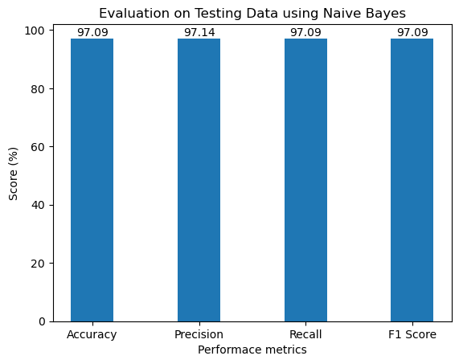

# News-Clasification
This study proposes a multinomial Naive Bayes Classifier technique for identifying news categories and analyzing their classification. For news classification, 1490 data (BBC News) are employed, including 336 business categories, 261 technology categories, 274 politics categories, 346 sports categories, and 273 entertainment categories. The datasets' performance is evaluated using accuracy, recall, precision, and the F1-score. These data are utilized to train the model, resulting in 98.85% and 97.09% accuracy on train and test data, respectively, with an 80-20 split.


## Prerequisite Library

There are some needed Libraries for this project to work. They are 

- numpy
- pandas
- sklearn
- matplotlib
- nltk
- WordCloud

> **Installation of numpy Library**
```bash
pip install numpy
```
> **Installation of pandas Library**
```bash
pip install pandas

```
> **Installation of scikit learn Library**
```bash
pip install -U scikit-learn
```
> **Installation of matplotlib Library**
```bash
pip install matplotlib
```

> **Installation of Seaborn Library**
```bash
pip install seaborn
```

> **Installation of WordCloud Library**
```bash
pip install WordCloud
```

> **Installation of WordCloud Library**
```bash
pip install nltk
```


# Methodology


# Implementation
Following library are used for traing, testing and evaluating the overal projects:

```bash
## For data manupulation

panda
numpy
nktk

## For Visualization

matplotlib
seaborn
WordCloud


## For Performance Measures
accuracy_score 
precision_score  
recall_score  
f1_score 
confusion_matrix 

## For Model traning and  Teting
train_test_split 
MultinomialNB

```

# Result and Analysis
Different results are obtained based on the performance metrics (accuracy, precision, recall, and F1 score).  The results of training and testing with **Naive Bayes** machine learning algorithms are displayed in the bar graph below.





There crrosponding confusion metric are:


# Conclusion 
Finally after data preprocessing (cleaning data, train_test_split model) and using Multinomial Naïve Bayes algorithm, it is concluded that the news are classified to their respective category with around 97% accuracy, precision, recall and f1 score. The findings of this study show that Naïve Bayes can successfully categorize news to their respective category. 


